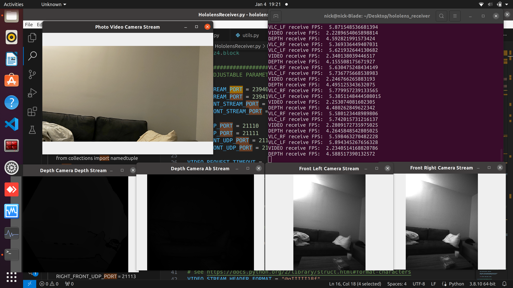
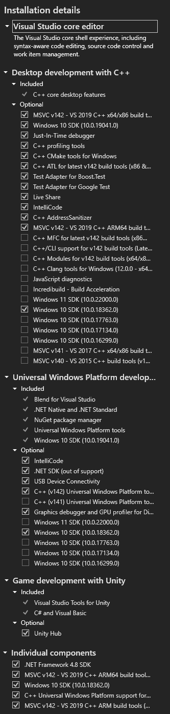
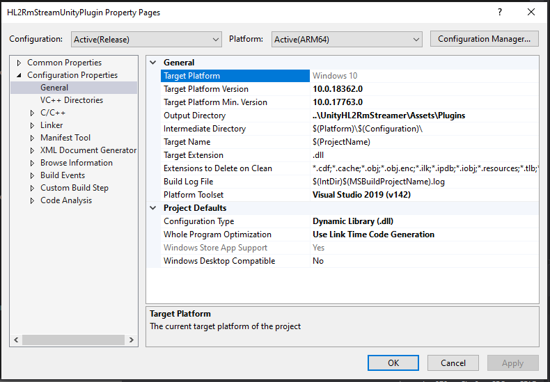
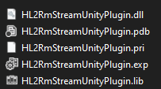

# Credit
This is based on the repository
https://github.com/cgsaxner/HoloLens2-Unity-ResearchModeStreamer

You should also read the README from that repository.

I did not maintain a history of my changes unfortunately.

Notable changes are the addition of streaming of the front left and front right
grayscale cameras of the Hololens 2, as well as the need for the PC receiver to
send a "request" for each frame as a means of flow-control to prevent
overloading of the TCP socket.  

# How to Use
Ensure that the Hololens and the PC are on the same netork and that the ports
listed below are not in use.
You must set the HoloLens_IP in `PythonReceiver/example_receiver.py`

Start the `UnityHL2RMStreamer` app on the Hololens (Build Instructions Below).

Then cd to `PythonReceiver` and run `example_receiver.py`

I have tried this using both Wirelessly and by using a USB-C to Ethernet adapter to
directly connect the HoloLens 2 to a PC.

The receiver was tested on both Windows
and Ubuntu. On Windows I had to comment out this line 

`self.socket.setsockopt(socket.SOL_TCP, socket.TCP_QUICKACK, 1)`
in the file `PythonReceiver/DataCollection/HololensReceiver.py`

You should see 5 image windows:

# Streaming Architecture
On the hololens, each of the four sensors has two threads running. One "FrameProcessor" thread
grabs the lastest sensor frame (and processes it if needed), and another "FrameStreamer" thread
sends the frame via TCP to the reciever.

In order to avoid overloading the TCP sockets which causes extreme latency
buildup, "FrameProcessor" threads wait for a "request" to initiate sending the
newest frame via the "FrameStreamer." The request is a UDP message containing
the string `"1\n"`.

The Python receiver sends a UDP request message to each appropriate port on the
HoloLens as soon as the it finishes receiving an image from the corresponding sensor

## Ports
The TCP Ports used for image data are:

- RBG: 23940
- Depth: 23941
- Left Grayscale: 23942
- Right Grayscale: 23943

The UDP Ports used for "reqests" are:
- RBG: 21110
- Depth: 21111
- Left Grayscale: 21112
- Right Grayscale: 21113

# Disabling Streams
You can disable receiving streams by setting the appropriate lines to False in `example_receiver.py`:
`STREAM_*Sensor_name* = False`

You can disable sending streams on the HoloLens side by going to the function
`void HL2Stream::StartStreaming()` inside of `HL2RmStreamUnityPlugin.cpp` and
commenting out the lines that say `m_p*Sensor_Name*Processor->Start()`

Disabling unused streams on the HoloLens may mildly improve performance  

# Performance
Performance is not the best. It is about 2-5 frames per second for all images. The images are currently sent with zero
compression. I previously tried implementing some lightweight image compression
on the Hololens but the Hololens then had overheating problems so I removed the
image compression. From what I remember, it was not obvious if image compression
made an improvement.

I have not profiled the code in any way to figure out where the
bottlenecks are, but I suspect that the Hololens CPU speed is a bottleneck.

The frame rates are low, but I improved the problem of latency buildup by having
the PC send "requests" as described above. Because of this, I have been able to
run video streaming for multiple hours with consistent performance and latency.

# Notes 
The naming of things is inconsistent throughout the code. In general:

- `PV` or `Video` refers to the RGB camera
- `AHAT` or `Depth` refers tp the Depth camera
- `AB` refers to the IR reflectivity image from the depth camera
- `VLC` refers to the two grayscale cameras
- `LF` refers to the "left front" grayscale camera
- `RF` refers to the "right front" grayscale camera

# Build Instructions

## Visual Studio 2019 Installation Details
This was tested with Visual Studio 2019 with the following Installation configuration:

## Visual Studio Build DLL
You should open `HL2RmStreamUnityPlugin/HL2RmStreamUnityPlugin.sln` and
make sure Visual Studio is configured for `Release` and `ARM64`. Then press
`Build->Build Solution`

## Visual Studio Build Output
The Visual Studio Solution for `HL2RmStreamUnityPlugin` is configured to output
the appropriate .DLL into the Unity project upon building:

You should quickly check that `UnityHL2RmStreamer\Assets\Plugins` contains the
following up to date files:

if not, you should copy them into this location manually

# Unity Version
The version of Unity this was tested with is `2019.4.31f1`

This Unity Project is not configured to display AR content. It is an
empty scene. While running, the hololens will show a solid white display. The `StartStreamer.cs` script is the entry point to the .DLL